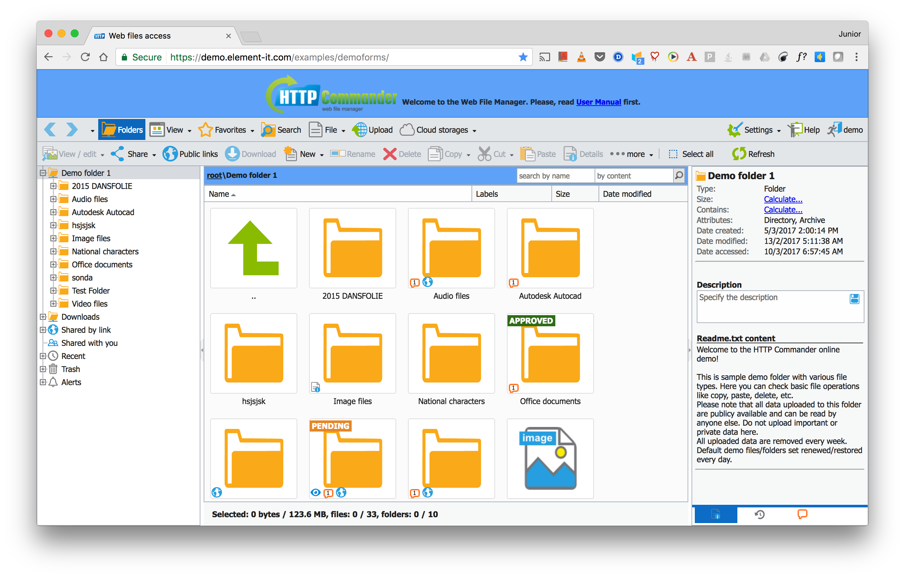
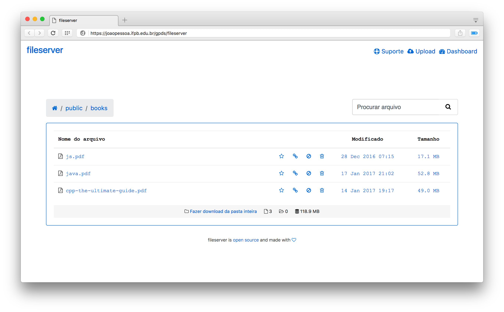

# fileserver

**fileserver** é um servidor de arquivos baseado em HTTP, desenvolvido em [Node.js](http://nodejs.org).

### Motivação

A necessidade de compartilhar arquivos usando um servidor que só tem acesso externo a Internet pela porta 80.

## Requisitos

O principal requisito para o funcionamento do aplicativo é ter o **Node.js** instalado e funcionando. Algumas bibliotecas também são necessárias: 
- [Moment.js](https://momentjs.com/)
- [wget-improved](https://github.com/bearjaws/node-wget).
- [Sorttable](https://kryogenix.org/code/browser/sorttable/)

## Funcionalidades

- Visualizar o conteúdo de diretórios;
- Baixar arquivos do servidor;
- Upload de arquivos para o servidor.

## Instalação

A instalação do aplicativo é simples e pode ser feita de duas formas, via Git ou fazendo o download do repositório [compactado](https://github.com/ajunior/fileserver/archive/master.zip).

### Clonando o repositório

```sh
$ git clone https://github.com/ajunior/fileserver.git
```

## Iniciando

Acesse o diretório onde o aplicativo foi clonado ou descompactado e execute a aplicação, conforme exemplo abaixo:

```sh
$ node app.js --rootdir=/path/to/dir
```

Em seguida, usando um navegador de arquivos, acesse a pasta 'front-end' dentro do diretório do aplicativo e abra o arquivo 'index.html' em qualquer browser.

## Inspiração

O Projeto é inspirado no site abaixo:



## Protótipo



## Recursos da API

- No *backend* foi implementado uma API REST, para visualização e download de arquivos do servidor para o cliente.
- Também foi utilizado a biblioteca *wget-improved* para permitir que arquivos sejam baixados direto para o servidor, via Wget, por solicitação do usuário.

## Contato

Nome | Email | Twitter 
----- | ------ | -----
Adjamilton Junior | jr@ieee.org | @ajr_almeida
Rayssa Freitas | rayssafreitas@live.com | @rayssafreitas

## Licença

O desenvolvido deste projeto é regido sob a licença [Apache 2.0](https://www.apache.org/licenses/LICENSE-2.0).